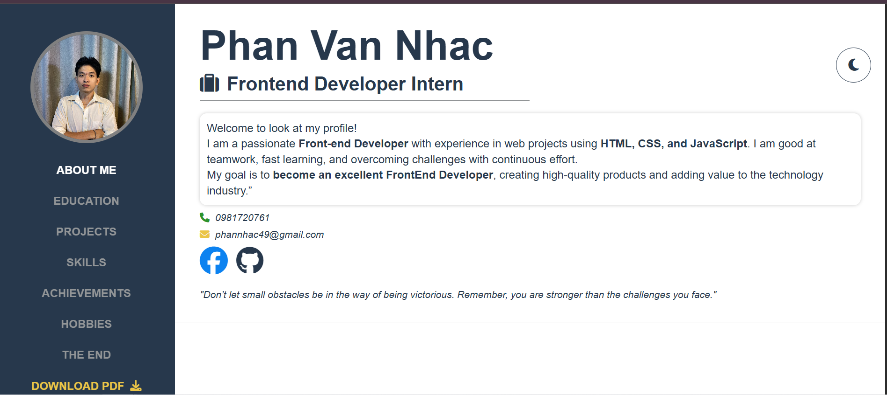
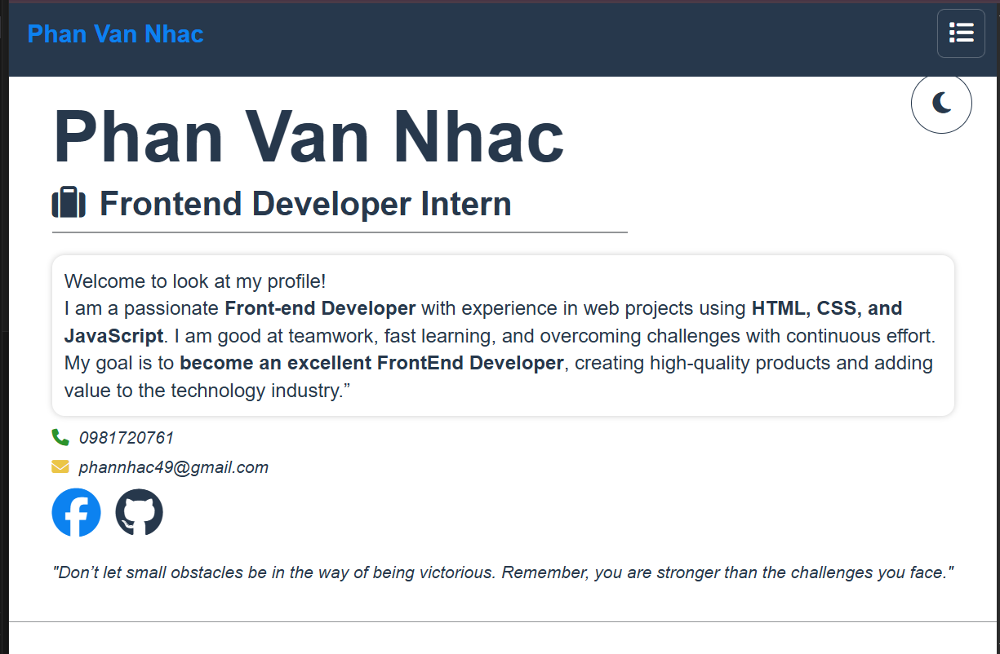

# 📚 My Online CV

This is a personal website built with HTML, CSS, and JavaScript, showcasing my Frontend skills and documenting my amazing projects on my journey to becoming a Frontend Developer. With a friendly interface, responsive, and light/dark mode, this CV is where I proudly share my achievements and passion! 🚀
- **My CV on computer**
  
- **My CV on Mobile**
  
## 🎯 Goal: 
- Demonstrate your **HTML, CSS, JavaScript** skills through a beautiful and smooth interface.
- Save the outstanding projects you have done in your programming journey.
- Create a professional portfolio to apply for a Frontend Developer position.

**Practical application**: An online CV to impress employers, and at the same time, a place to update my learning journey.
---
## ✨ Key Features:
- 📱 **Responsive**: Looks great on both desktop and mobile devices.
- 🌙 **Light/Dark Mode**: Switch between light and dark interface for enhanced user experience.
- 📄 **Projects**: Showing projects like Shine-Smile, The-Bensik, The-Lesson, The-band.
- 📥 **Download CV PDF**: Download CV in PDF format.

## 🛠 Technologies Used
-  **HTML/CSS**, **JavaScript (ES6)**, **GitHub Pages**:
## 📖 Installation
1. **Clone the repository**:
   ```bash
   git clone https://github.com/vannhac/My-CV-Online.git
   ```
2. **Navigate to the project folder**:
   ```bash
   cd My-CV-Online
   ```
3. **Open the CV**:
   - Open `index.html` in a browser to view the CV locally.
   - Alternatively, deploy to GitHub Pages or a web server.

---
